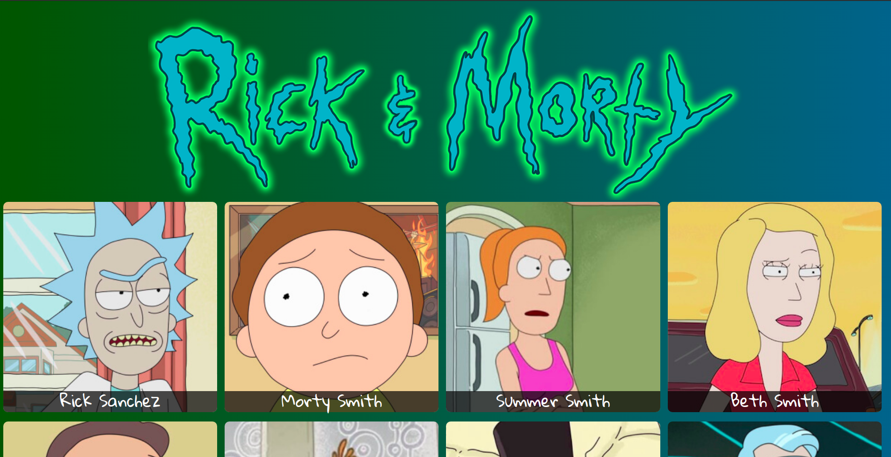
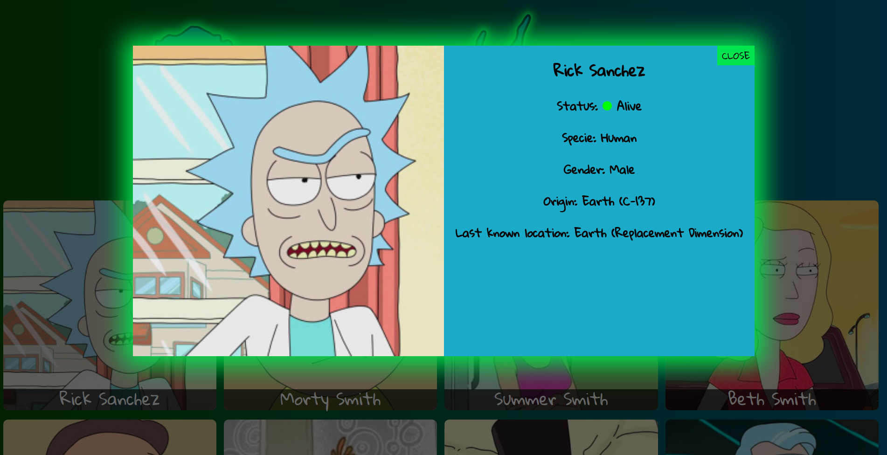
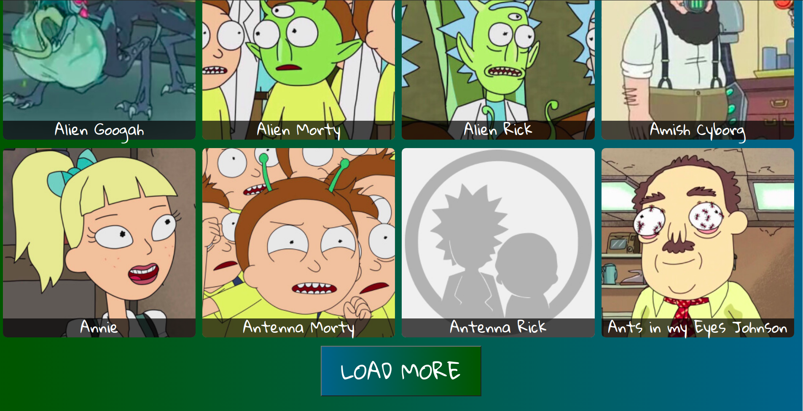

# Rick and Morty

An app created in React that use the [Rick and morty api](https://rickandmortyapi.com/), and shows all characters of the show

## The characters are in the main page

## And by clicking on the characters their characteristics are shown

## At the bottom of the page be a button that allows shows more characters

